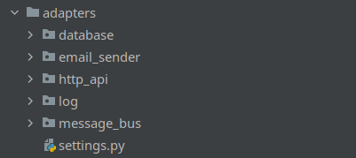
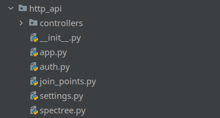

# **Адаптеры**

## **Предисловие**
Содержат всю адаптерную логику взаимодействия, 
которая включает работу с внешними ресурсами. В данном разделе не может содержаться бизнес логики, он может содержать только сериализацию/десериализация данных из внешних источников, а также запись и общение с внешними источниками
- БД
- API
- Файлы
- Логи
- Linux CRON
- Брокер сообщений

---
### [**Взаимодействие с БД**](./database)

В данной директории содержится вся работа с БД
- Запросы
- Управление миграциями
- Описание таблиц
- Маппинг таблиц

---

### [**Рассылка сообщений на почту**](./email_sender)
Данный адаптер, отвечает за рассылку почты по протоколу SMTP.

---

### [**Контроллеры**](./http_api)

В данной директории мы настраиваем 
API для работы с внешними интерфейсами и сервисами. 

---

### [**Логирование**](./log)

Работа с логами приложения

---

### [**Очередь сообщений**](./message_bus)

Обеспечивает общение между процессами посредством rabbitmq