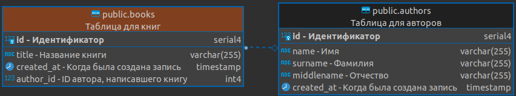

# Описание таблиц в базе данных с помощью SQLAlchemy (Imperative)


**Описываемый файл**: [tables.py](../../../../../../components/backend/demo_project/adapters/database/tables.py)


---
## **Предисловие**
* В разрабатываемых проектах, будет использоваться императивный подход 
описания таблиц в БД. Такой подход позволяет разделить логику описания сущности БД (ограничения, типы данных, связи и т.д.) и дата-классов, которые имеют только описание типов (аннотации). Императивное описание также необходимо для соблюдения нашей архитектуры.


---
## **Описание**

* В импортах мы указываем всё необходимое для описания таблицы БД.
    - Типы данных: Boolean, DateTime, Integer, String;
    - Классы описания таблицы: Column, ForeignKey, MetaData, Table;
    - Вспомогательные функции: func.
```python
from sqlalchemy import Boolean, Column, DateTime, ForeignKey, Integer, MetaData, String, Table, func
```

* Данный словарь, отвечает за более понятное формирование
имен ограничений в базе данный (FK, PK и т.д.). В противном случае, обычно, имена таких полей формируются с помощью хеша. 
```python
naming_convention = {
    'ix': 'ix_%(column_0_label)s',
    'uq': 'uq_%(table_name)s_%(column_0_name)s',
    'ck': 'ck_%(table_name)s_%(constraint_name)s',
    'fk': 'fk_%(table_name)s_%(column_0_name)s_%(referred_table_name)s',
    'pk': 'pk_%(table_name)s'
}
```


* Создание объекта таблицы, по которому, будет создана сущность в БД.

```python
books = Table(
    'books',    # Название таблицы
    metadata,   # Объект метаданных. Для последующих миграций
    Column(     # Описание столбца.
        'id',                   # Название столбца
        Integer,                # Тип данных
        primary_key=True,       # Первичный ключ
        comment='Идентификатор' # Комментарий для отображения в БД.
    ),
    Column(
        'title',                # Название столбца
        String(255),            # Тип данных
        nullable=False,         # Может ли быть пустым.
        comment='Название книги'
    ),
    Column(
        'created_at',           # Название столбца
        DateTime,               # Тип данных
        default=func.now(),     # Значение по умолчанию (текущее время)
        nullable=False,         # Может ли быть пустым.
        comment='Когда была создана запись'
    ),
    Column(
        'author_id',            # Название столбца
        ForeignKey(             # Указание внешнего ключа
            'authors.id',       # [имя таблицы].[поле]
            ondelete='SET NULL' # Ограничение: SET NULL, CASCADE и т.д.
        ),
        comment='ID автора, написавшего книгу'
    ),
    comment='Таблица для книг'  # Общее описание таблицы для БД.
)
```


---
## **Правила**
1. Обязательное описание таблицы с помощью `comment`;
2. Обязательное описание полей таблицы с помощью `comment`;
3. `comment` указывается в самом конце описания поля, таблицы;
4. Обязательное указание правил удаления поля в ссылках на другие таблицы c помощью `ondelete`;
5. Явное указание возможности не хранить что-либо в поле с помощью `nullable`;
6. В случае необходимости, указать `default` для поля.
7. Имена полей и таблицы в `snake_case`;
8. Описание всех внешних ключей в конце описания таблицы;
9. `PK` (primary key) должен находиться в самом начале описания таблицы.


---
## **Примечание**
* Данное описание таблиц, имеет множество преимуществ. Во-первых, 
значения полей, и таблицы, никогда не будут утеряны (что обычно происходит при разработке больших проектов). Во-вторых, люди, которые 
не работают с кодом, могут увидеть структуру базы данных и сразу понять, какое
поле, таблица, за что отвечает. Для разработчиков это так же является плюсом, так как, не нужно перемещаться по файлам с описанием таблиц и искать её описание. 
* На рисунке предоставлен функционал программы DBeaver, где можно увидеть название таблицы, и описание полей.





---
## **Полезные ссылки**
1. [Императивный подход](https://docs.sqlalchemy.org/en/14/orm/mapping_styles.html)
2. [Метадата](https://docs.sqlalchemy.org/en/20/core/metadata.html)

