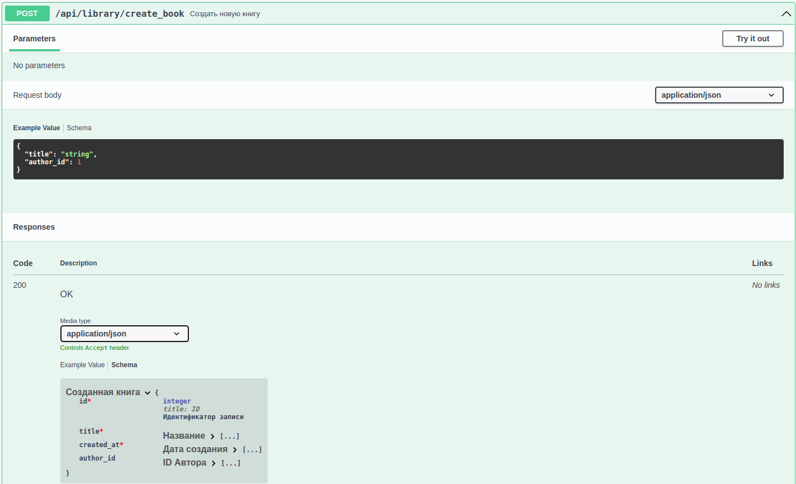

# Котроллеры

**Описываемый файл**: [library.py](../../../../../../components/backend/demo_project/adapters/http_api/controllers/library.py)


---
## **Предисловие**
* Контроллеры отвечают за:
1. Валидацию входящих параметров, 
2. Передачу валидированных данных в [сервисы](../../application/services.md) для последующей работы с ними и валидацией исходящих данных. 
3. Ограничения по правам доступа пользователей к тем или иным апи.

* В них не должна присутствовать какая-либо бизнес-логика по работе
с данными.
* В целом, описание апи находится в файлах этой директории.

---

* Необходимые импорты для работы. Описания в виде комментариев над импортами.
```python
# Для формирования словаря из объекта класса
from attr import asdict
# Для аннотации запроса клиента и ответа сервера
from falcon import Request, Response
# Класс в котором будут описаны способы валидации
from spectree import Response as RespValidate

# Группы пользователей
from demo_project.adapters.http_api.auth import Groups
# Декоратор для работы с сессиями
from demo_project.adapters.http_api.join_points import join_point
from demo_project.adapters.http_api.spectree import spectree
# Классы, которые валидируют, входящие запросы и исходящие ответы.
from demo_project.application.dto.library import *
# Импорт сервисов для аннотации
from demo_project.application import services
# Декоратор, позволяющий не писать __init__(...)
from ssd_libs.components import component
# Декораторы для аутентификации и авторизации
from ssd_libs.http_auth import authenticate, authenticator_needed, authorize
```


* Пример класса контроллера, описание предоставлено в виде комментариев.
```python
@authenticator_needed 
@component
class Library:
    # Объект сервиса(прокидывается на этапе сборки)
    library_service: services.LibraryService    

    ... # Описан последний эндпоинт

    # Проверка аутентификации пользователя.
    @authenticate
    # Открытие сессии на время запроса. 
    # И её последующее корректное закрытие.
    @join_point
    # Создать книжечку, может только пользователь группы ADMINS
    # Так же, можно указывать группы через прямую черту (или)
    # @authorize(Groups.ADMINS | Groups.USERS) 
    @authorize(Groups.ADMINS)   
    @spectree.validate(
        json=BookCreateReq, # Валидация тела запроса.
        resp=RespValidate(HTTP_200=BookCreateResp), # Валидация ответа.
        tags=(library_tag, )    # Указание тега, для отображения в сваггере.
    )
    # Имя метода контроллера должно начинается с on_[METHOD HTTP]. 
    # Далее указывается имя конечно точки.
    def on_post_create_book(self, req: Request, resp: Response):
        # Комментарий также отображается в свагере
        """ Создать новую книгу """ 
        book = self.library_service.create_book(req.context.json)
        # готовый овтет присваивается сюда, 
        # после чего приосходит его валидация
        resp.media = asdict(book)   
```
<br>

* Благодаря такому описанию, разработчик может:
    - Видеть входящие\исходящие параметры и их описание
    - Иметь возможность тестовых запросов без ручного написания curl
    - Видеть Тип запроса (POST GET и т.д.)
* Таким образом, ваш код является [документацией](spectree.md) вашего API.




---
## Полезные ссылки
1. [spectree](https://spectree.readthedocs.io/en/latest/)
2. [falcon](https://falcon.readthedocs.io/en/stable/index.html)