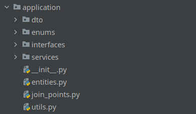

# Уровень приложения

* В слое приложения лежит все что относится к бизнес логике (сущности, DTO, константы, DS модель, сервисы и тд. и тп). 
Этот слой не зависит от интеграций (адаптеров). Для этого применяется механизм DI. В слое приложения описываются интерфейсы получения данных, в адаптерах они реализуются.  

* Если предметная область сложная, то создаются [сущности](entities.md) предметной области (которые маппятся на таблицы в слое адаптеров). В сущностях описывается их поведение и инварианты.  

* Если предметная область простая (например, строим простые графики), то достаточно описать [data transfer objects (DTO)](dto.md) и возвращать их из репозиториев/шлюзов/api клиентов в первичных адаптерах. 
Простые структуры данных (словари, списки скалярных значений, списки словарей) между слоями передаваться не должны. DTO это обычные датаклассы с простейшим поведением.  

* В [сервисы](services.md) внедряются вторичные адаптеры, и они работают с сущностями. Валидация данных происходит при вызове публичного метода сервиса из адаптеров, для этого на уровне сервисов описываются DTO в виде pydantic моделей.  

* Из одного сервисы вполне можно вызывать другой. Тут вопрос проектирования предметной области, лучше сильно не запутывать связями.  

* Код DS (feature engineering и вызов моделей) лучше держать в отдельном пакете.  

* В этом же слое описываются всевозможные ошибки.