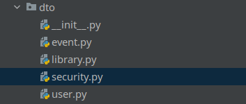
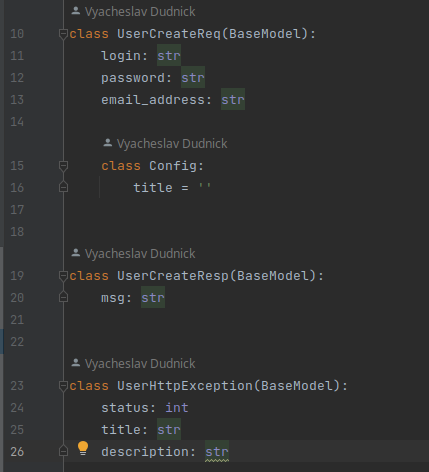

# Data transfer object (DTO) 

Данные объекты мы используем для транспортировки и валидации данных,
а так же для отображения формата приходящих и исходящих запросов 
в рамках документации [Spectree](../adapters/http_api/spectree.md)

### Есть три основных типа объектов
1) Request - Используются для валидации, передачи и задания формата
в документации входящих запросов нашего API;
2) Response - Используются для валидации, передачи и задания формата
в документации исходящих запросов нашего API;
3) Exception - Используются для валидации, задания формата ошибок
в документации нашего API.

**Посмотреть код в рамках демо проекта**: [user.py](../../../../../components/backend/demo_project/application/dto/user.py)

## Полезные ссылки

1) [Wiki по понятию DTO](https://ru.wikipedia.org/wiki/DTO)
2) [Официальная документация pydantic](https://docs.pydantic.dev/latest/)