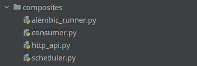

# Запуск процессов

---

Тут происходит сборка компонентов для запуска процесса. Именно тут инициализируются настройки, внедряются зависимости.  

Например, для сборки [HTTP API](http_api.md) нужно:
- инстанцировать engine sqlalchemy
- создать connection
- внедрить его в репозитории
- инстанцировать другие компоненты со внедренными зависимостями
- инстанцировать сервисы
- передать сервисы в фабрику http app (слой адаптеров)
- фабрика зарегистрирует контроллеры с внедренными сервисами
- для запуска нужно натравить gunicorn на объект app(Falcon) в модуле композита