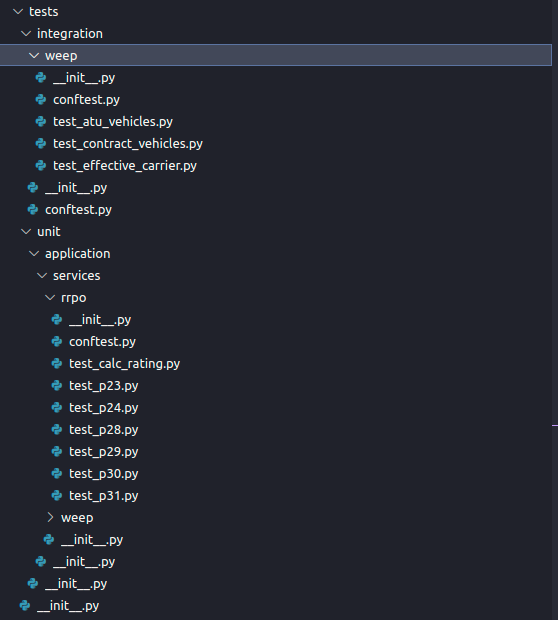

# Тестирование кода.

* Зачем нужно писать тесты? Как минимум за тем, чтобы после
минимального изменения какого-то функционала в программе, не
проверять вручную, не сломалось ли остальная часть, ручное тестирование
сложное и затратное по времени. Так же, написание **правильных** тестов, 
даёт уверенность в том, что программа работает корректно. 

* Написание тестов, это трудозатратный процесс, их стоит писать в том случае
когда есть уверенность в том, что какой-то метод, модуль и т.д не поменяет свою логику достаточное время.

* В проектах, в основном, используется два вида тестирования:
  - Юнит тестирование
  - Интеграционное тестирование

* Для тестирования основная библиотека является pytest, вспомогательная
unittest.

* Пример структуры (Пример взят из мат.модели)

---
## Полезные ссылки
1. [Python MOCK](https://docs.python.org/3/library/unittest.mock.html)
2. [Интеграционное тестирование](https://habr.com/ru/articles/556002/)
3. [pytest documentation](https://docs.pytest.org/_/downloads/en/stable/pdf/)
4. [unittest documentation](https://docs.python.org/3/library/unittest.html)