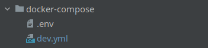

# Настройка композеров дейплоймента

**Описываемые файлы**: 
- [dev.yml](../../deployment/docker-compose/dev.yml)
- [.env](../../deployment/docker-compose/.env)


## **Предисловие**
* В данной директории нет особого смысла в подробном описании тк за 
всей информацией можно обратиться к официальной документации по работе с docker-compose


## Правила

* Передача переменных окружения в контейнеры осуществляется явно для большей читаемости
```yaml
...
environment:
    POSTGRES_DB: ${DATABASE_NAME}
    POSTGRES_USER: ${DATABASE_USER}
    POSTGRES_PASSWORD: ${DATABASE_PASS}
    PGDATA: "/var/lib/postgresql/data/pgdata"
...
```
или
```yaml
...

environment:
    - DATABASE=postgres
    - DATABASE_NAME=${DATABASE_NAME}
    - DATABASE_HOST=${DATABASE_HOST}
    - DATABASE_PORT=${DATABASE_PORT}
    - DATABASE_USER=${DATABASE_USER}
    - DATABASE_PASS=${DATABASE_PASS}

...
```

* Устанавливать название контейнера явно
```yaml
...
container_name: api-demo_project
...
```

* Для запуска кастомных контейнеров использовать entrypoint_*
```yaml
...
command: ['entrypoint_api.sh']
...
```

* В начале композера описывать для каких целей используется данная конфигурация
```yaml
# Используется для деплоя проекта на DEV стенде и локальной разработки фронтенд разработчиков
version: '3.3'

...
```
* Название композера должно быть идентично ветке для которой он используется 
(если сборка специфична и не подразумевает наличие ветки в репозитории, то также указываем это в описание композера)




* Если в контейнерах используется ***"network_mod: host"***, 
то должен быть комментарий с пояснениями почему был выбран данный режим

* Использовать 4 пробела
* Между контейнерами 1 пустая строка
* Разделять переменные окружения на логические блоки
```yaml
...
environment:
    - DATABASE=postgres
    - DATABASE_NAME=${DATABASE_NAME}
    - DATABASE_HOST=${DATABASE_HOST}
    - DATABASE_PORT=${DATABASE_PORT}
    - DATABASE_USER=${DATABASE_USER}
    - DATABASE_PASS=${DATABASE_PASS}

    - RABBITMQ_PASS=${RABBITMQ_PASS}
    - RABBITMQ_HOST=${RABBITMQ_HOST}
    - RABBITMQ_USER=${RABBITMQ_USER}
    - RABBITMQ_PORT=${RABBITMQ_PORT}

    - SMTP_HOST=${SMTP_HOST}
    - SMTP_PASSWORD=${SMTP_PASSWORD}
    - SMTP_SENDER=${SMTP_SENDER}
    - SMTP_PORT=${SMTP_PORT}

    - SWAGGER_ON=${SWAGGER_ON:-true}
...
```
* Обязательное указание томов для сервисов, хранящих данные и важные логи
```yaml
volumes:
    - /var/pg/demo_project:/var/lib/postgresql/data
```
---


## Полезные ссылки
1. [Docker для чайников](https://habr.com/ru/companies/ruvds/articles/450312/)
2. [Официальная документация по ***composer***](https://docs.docker.com/compose/)
